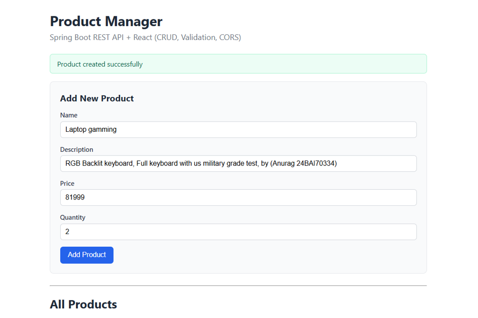
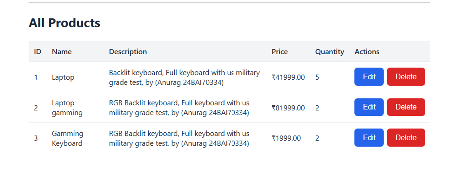
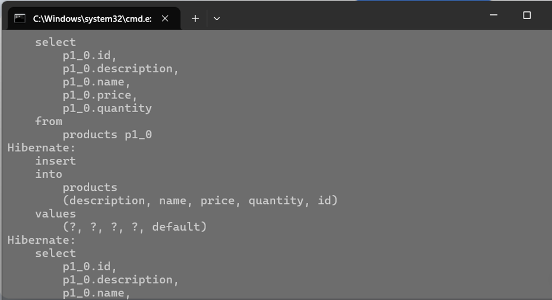

# Experiment 1.5.1 – RESTful API with Spring Boot & React

## Aim

To design and implement RESTful APIs using Spring Boot with validation, standardized responses, and layered architecture connected to a React frontend.

---

## Objectives

- Design RESTful APIs using resource-based URLs.
- Perform CRUD operations using Spring Boot.
- Implement Bean Validation for user input.
- Connect React frontend with Spring Boot backend.
- Maintain a standardized API response structure.

---

## Technologies Used

- Spring Boot
- Spring Data JPA
- React.js
- H2 Database
- Maven
- REST API
- Bean Validation

---

## Software Requirements

- Java 17+
- Maven 3.6+
- Node.js 18+
- npm
- VS Code / IntelliJ IDEA

---

## Project Structure

```text
exp1_5_1/
│
├── backend/
│   ├── controller/
│   ├── service/
│   ├── repository/
│   ├── entity/
│   ├── dto/
│   └── config/
│
├── frontend/
│   ├── src/
│   ├── components/
│   └── App.js
│
├── screenshots/
│   ├── product-manager.png
│   └── swagger-ui.png
│
└── README.md
```

---

## REST API Endpoints

- **POST** `/api/products` → Create a new product
- **GET** `/api/products` → Get all products
- **GET** `/api/products/{id}` → Get product by ID
- **PUT** `/api/products/{id}` → Update product
- **DELETE** `/api/products/{id}` → Delete product

---

## Standard Response Format

```json
{
  "success": true,
  "message": "Product created successfully",
  "data": {
    "id": 1,
    "name": "Keyboard",
    "price": 999.0,
    "quantity": 10
  },
  "timestamp": "2026-09-14T10:30:00"
}
```

---

## Architecture

```text
React Frontend
       │
       ▼
Product Controller
       │
       ▼
Product Service
       │
       ▼
Product Repository
       │
       ▼
     H2 Database
```

---

## Key Features

- Complete CRUD operations
- Bean Validation (`@Valid`, `@NotBlank`, `@Positive`)
- Layered Architecture
- Standardized JSON Responses
- React Product Manager Interface
- H2 In-Memory Database

---

## Output Screenshots

### Product Manager Dashboard





### Backend Work and Change




---

## Learning Outcomes

- Developed RESTful APIs using Spring Boot.
- Connected React with backend REST services.
- Implemented CRUD operations with validation.
- Understood layered architecture (Controller → Service → Repository).
- Tested APIs using Swagger UI and browser requests.

---

## Conclusion

This experiment successfully demonstrates the development of a full-stack RESTful application using Spring Boot and React. It implements CRUD functionality, validation, standardized responses, and follows scalable backend architecture principles.