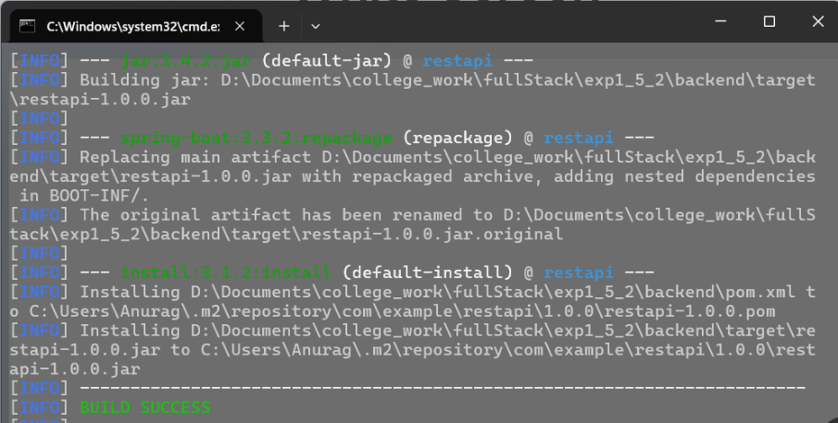
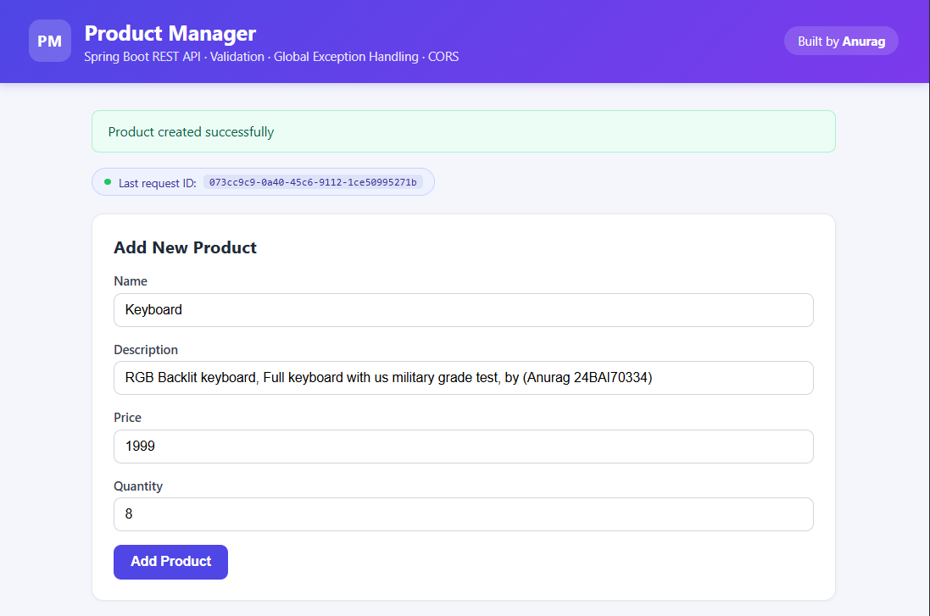
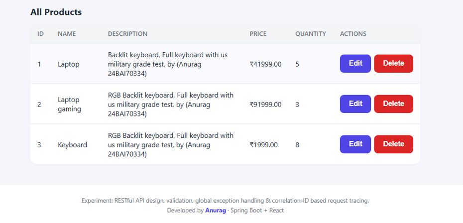
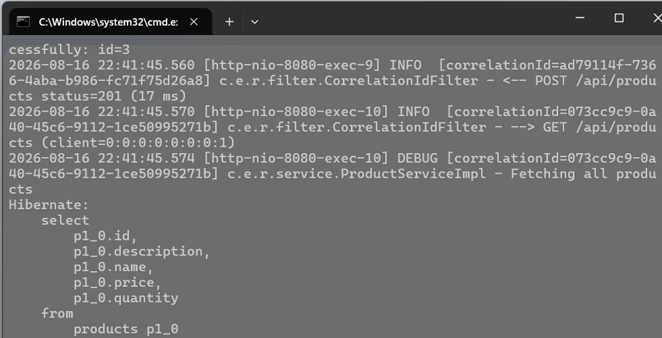

# Experiment 1.5.2 – Global Exception Handling & Structured Logging

## Aim

To implement global exception handling and structured logging for building robust and observable backend systems using Spring Boot and React.

---

## Objectives

- Implement global exception handling using `@ControllerAdvice`
- Use structured logging with SLF4J
- Generate Correlation IDs for request tracing
- Improve backend observability and debugging
- Perform CRUD operations with Bean Validation

---

## Technologies Used

- Spring Boot
- Spring Data JPA
- React.js
- H2 Database
- SLF4J Logging
- Bean Validation
- REST API

---

## Software Requirements

- Java 17+
- Maven 3.6+
- Node.js 18+
- npm
- VS Code / IntelliJ IDEA

---

## Project Structure

```text
exp1_5_2/
│
├── backend/
│   ├── controller/
│   ├── service/
│   ├── repository/
│   ├── entity/
│   ├── exception/
│   ├── filter/
│   ├── config/
│   └── logs/
│
├── frontend/
│   ├── src/
│   ├── components/
│   └── App.js
│
└── README.md
```

---

## API Endpoints

- **POST** `/api/products` → Create a product
- **GET** `/api/products` → Get all products
- **GET** `/api/products/{id}` → Get product by ID
- **PUT** `/api/products/{id}` → Update product
- **DELETE** `/api/products/{id}` → Delete product

---

## Correlation ID & Structured Logging

- Every request receives a unique **Correlation ID**
- `CorrelationIdFilter` generates or reads the ID
- SLF4J MDC attaches the ID to every log entry
- The same ID is returned in the API response
- Makes request tracking and debugging much easier

---

## Standard Response Format

```json
{
  "success": true,
  "message": "Product created successfully",
  "data": {
    "id": 1,
    "name": "Keyboard"
  },
  "timestamp": "2026-09-14T10:30:00",
  "correlationId": "8b2b4b6d-7b3d-4d8f-9e21-123456789abc"
}
```

---

## Architecture

```text
React Frontend
       │
       ▼
CorrelationIdFilter
       │
       ▼
Product Controller
       │
       ▼
Product Service
       │
       ▼
Product Repository
       │
       ▼
     H2 Database

GlobalExceptionHandler
       │
       ▼
 Structured Error Response
```

---

## Key Features

- Global Exception Handling
- Structured Logging with SLF4J
- Correlation ID Tracking
- CRUD Operations
- Bean Validation
- Layered Architecture

---

## Output Screenshots

### Build SUCESS



### Product Manager Dashboard




### Exception Handling



### Application Logs


---

## Learning Outcomes

- Implemented centralized exception handling.
- Understood structured logging and request tracing.
- Used Correlation IDs for debugging.
- Built a scalable Spring Boot backend with React integration.

---

## Conclusion

This experiment demonstrates how global exception handling and structured logging improve the reliability, maintainability, and observability of a Spring Boot REST API while providing consistent responses to the React frontend.