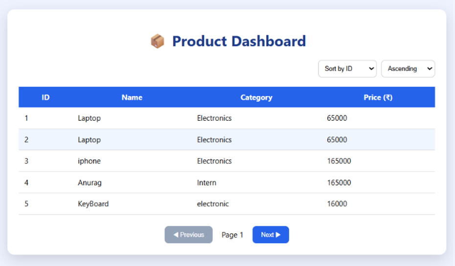
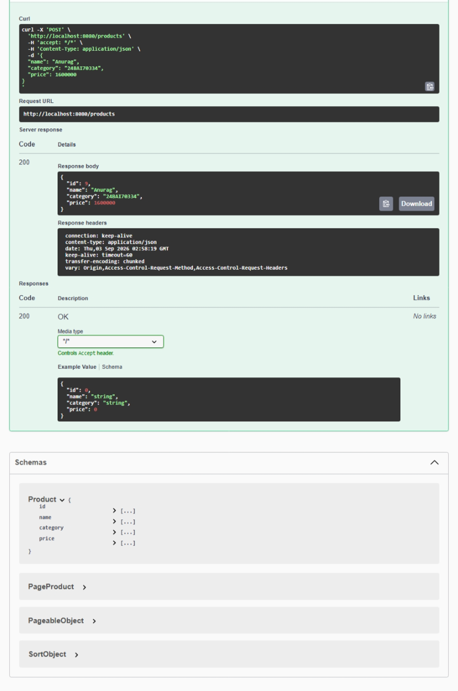
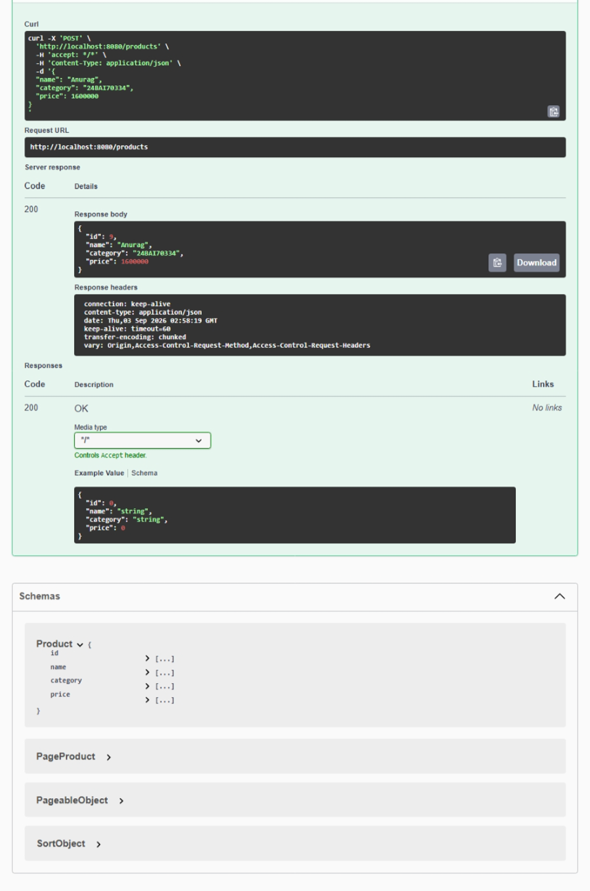

# Experiment 2.2.1 – Pagination & Sorting API

A full-stack application using Spring Boot, React, MySQL, and Swagger UI to implement server-side pagination and sorting of product records.

## Aim

To implement pagination and sorting in a REST API using Spring Boot and display the data in a React dashboard.

## Objectives

* Implement server-side pagination using Spring Data JPA.

* Apply sorting on different product fields.

* Connect Spring Boot backend with React frontend.

* Test REST APIs using Swagger UI.

* Display paginated product records in a responsive dashboard.

## Software Requirements

|
Software

|

Version

|
| --- | --- |
|

Java

|

17+

|
|

Spring Boot

|

3.x

|
|

React

|

18+

|
|

MySQL

|

8.x

|
|

Maven

|

3.9+

|
|

Swagger UI

|

OpenAPI

|

## Technologies Used

* Spring Boot

* Spring Data JPA

* React.js

* MySQL

* Swagger UI

* REST API

## API Endpoints

|
Method

|

Endpoint

|

Description

|
| --- | --- | --- |
|

GET

|

`/api/products`

|

Get paginated products

|
|

GET

|

`/api/products?page=0&size=5`

|

Pagination

|
|

GET

|

`/api/products?sortBy=id&direction=asc`

|

Sorting

|

## Project Structure

```
pagination-sorting-api/
│── backend/
│   ├── controller/
│   ├── entity/
│   ├── repository/
│   ├── service/
│   └── application.properties
│
├── frontend/
│   ├── src/
│   ├── components/
│   └── App.js
│
├── screenshots/
│   ├── dashboard.png
│   └── swagger-ui.png
│
└── README.md
```

## Features

* Server-side pagination

* Ascending & descending sorting

* Product dashboard in React

* MySQL database integration

* Swagger API documentation

## Output Screenshot

### Product Dashboard

Product Dashboard


### Swagger UI

Swagger UI


### SQL Database



## Learning Outcome

* Learned how to implement pagination using `Pageable`.

* Understood sorting with Spring Data JPA.

* Connected React frontend with Spring Boot REST APIs.

* Improved performance by fetching records page-wise.

## Conclusion

This experiment successfully demonstrates server-side pagination and sorting using Spring Boot and React. The application efficiently retrieves and displays product records while reducing unnecessary data loading and improving user experience.
