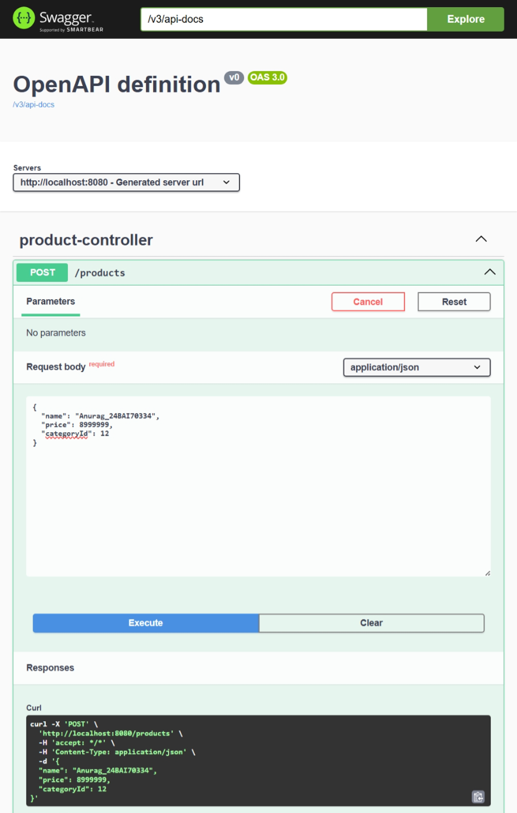

# Experiment 2.2.2 – Backend Optimization Dashboard

## Aim
To optimize backend read operations using efficient database query strategies and caching in a Spring Boot application with a React frontend.

## Objective
- Understand the N+1 Query Problem
- Implement JOIN FETCH optimization
- Apply Caching using Spring Cache
- Improve REST API response time
- Integrate Spring Boot with React and Swagger UI

## Technologies Used

| Technology | Purpose |
|------------|---------|
| Spring Boot | Backend REST API |
| Spring Data JPA | Database operations |
| MySQL | Database |
| React.js | Frontend Dashboard |
| Swagger UI | API Testing |
| JOIN FETCH | Query Optimization |
| Spring Cache | Caching Mechanism |

## Project Structure

```text
backend-optimization/
│── controller/
│── service/
│── repository/
│── entity/
│── config/
│── application.properties

frontend/
│── src/
│── components/
│── App.js
```

## Features
- JOIN FETCH optimized API
- Cached API using Spring Cache
- React performance dashboard
- Swagger UI integration
- Product & Category relationship
- Response time monitoring

## API Endpoints

| Method | Endpoint | Description |
|--------|----------|-------------|
| GET | `/products/optimized` | Fetch products using JOIN FETCH |
| GET | `/products/cached` | Fetch products using Cache |

## Output Screenshot

Place your screenshot inside a folder named **screenshots**.

```text
screenshots/
└── backend-dashboard.png
```

Display it in README:

```md



```

## Learning Outcome
- Learned how JOIN FETCH removes the N+1 query issue.
- Understood backend caching using Spring Cache.
- Improved API performance and reduced response time.
- Connected Spring Boot backend with a React frontend.
- Tested REST APIs using Swagger UI.

## Conclusion
The experiment successfully optimized backend read operations by combining JOIN FETCH and caching techniques, resulting in faster API responses and an efficient full-stack application.